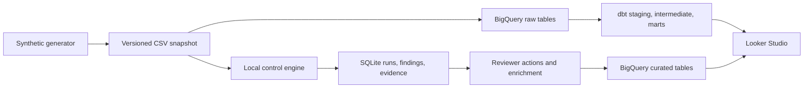

# ControlScope

ControlScope is an open-source, synthetic audit analytics demo. It generates financial transactions and identity events, evaluates eight deterministic controls and two statistical detectors, links every finding to source rows, and records reviewer decisions in an append-only log. The offline demo needs only Python 3.11 or newer. BigQuery, dbt, Gemini, and Looker Studio are optional cloud steps.

This is a portfolio demonstration. Findings are review leads, not conclusions of fraud or regulatory violations. The public workflow accepts synthetic data only.

## Run the local demo

```bash
python -m venv .venv
# Windows PowerShell: .venv\Scripts\Activate.ps1
# macOS/Linux: source .venv/bin/activate
python -m pip install -e .
controlscope demo
controlscope findings
controlscope dashboard
controlscope verify
```

Open `data/dashboard.html` in a browser for the local, read-only dashboard. It shows control coverage, risk distribution, reviewer status, aging, and linked source rows. Select a finding to see the evidence. To review it, copy its `finding_id` from `controlscope findings`:

```bash
controlscope show FINDING_ID
controlscope review FINDING_ID confirm --actor analyst@example.test --reason "Matched the supporting rows"
controlscope review FINDING_ID dismiss --actor analyst@example.test --reason "Approved test transaction"
controlscope review FINDING_ID override --score 35 --actor analyst@example.test --reason "Compensating control verified"
controlscope enrich FINDING_ID
controlscope export
controlscope dashboard
```

Each decision requires an actor and rationale. An override also requires a replacement score from 0 to 100. Rebuild the dashboard after decisions to refresh its static snapshot. `controlscope export` writes an audit summary to `data/audit-summary.json`.

The default dataset uses seed `42` and a snapshot date of `2026-01-31`. To change them:

```bash
controlscope generate --seed 7 --as-of 2026-02-28
controlscope run
```

`controlscope demo` generates and runs in one command. Repeating a run with unchanged data, code, and registry reuses the run ID and preserves review history. The manifest stores the dataset digest, source-code digest, Git commit, seed, snapshot date, control versions, and risk formula version. `data/` is ignored by Git because it contains reproducible generated artifacts.

## Controls and scoring

The [control registry](controls/registry.json) defines versions, descriptions, and base scores. The [dbt seed](seeds/control_registry.csv) carries the same versions and scores for BigQuery. A test checks that they match.

| Deterministic control | Trigger |
| --- | --- |
| Duplicate invoice | Same vendor and invoice ID occur in more than one paid row |
| Split payment | At least two same-day payments below USD 10,000 to one vendor total USD 10,000 or more |
| Off-hours payment | Paid between 22:00 and 06:00 UTC |
| Inactive vendor payment | Paid row references an inactive vendor |
| Self approval | Initiator and approver IDs match |
| Missing high-value approval | Payment above USD 25,000 has no approver ID |
| Terminated user login | A terminated user has a login event |
| Dormant privileged login | At least 30 days between a privileged user's logins |

The amount outlier detector uses the median and median absolute deviation (MAD) per business unit; it flags robust z-scores above 6. The login burst detector compares a user's daily count with the median and MAD across user-days, requiring at least eight extra logins and a robust score above 6 (or a zero-MAD baseline). Both run on synthetic records with deliberately injected examples.

Risk score = `min(100, base_risk + min(15, 5 × (evidence_row_count − 1)))`. High is 80–100, medium is 50–79, and low is 0–49. The score indicates review priority, not probability of misconduct.

## Cloud workflow

Install cloud dependencies and configure [Application Default Credentials](https://cloud.google.com/docs/authentication/provide-credentials-adc) with access to a BigQuery project. Costs and quota depend on your Google Cloud account.

```bash
python -m pip install -e ".[cloud]"
controlscope generate
controlscope run
controlscope upload-bigquery --project YOUR_PROJECT --dataset controlscope
cp profiles.example.yml profiles.yml  # edit project and authentication settings
dbt seed --profiles-dir .
dbt run --profiles-dir .
dbt test --profiles-dir .
controlscope publish-bigquery --project YOUR_PROJECT --dataset controlscope
```

On Windows PowerShell, use `Copy-Item profiles.example.yml profiles.yml` instead of `cp`. The upload creates `raw_*` BigQuery tables; dbt creates staging views, intermediate views, and finding/coverage marts. Publication copies versioned runs, all source-row snapshots, findings, evidence, review actions, and enrichment to curated BigQuery tables for reporting. Rerun `publish-bigquery` after reviewer actions. The local SQLite file is the offline working store; the cloud dataset holds the published analytical record.

For Google Cloud Shell, [scripts/deploy_cloud_shell.sh](scripts/deploy_cloud_shell.sh) performs the same sequence after the repository is available there: `bash scripts/deploy_cloud_shell.sh YOUR_PROJECT controlscope`.

To request Gemini enrichment, set `GEMINI_API_KEY` in your environment and run:

```bash
controlscope enrich FINDING_ID --provider gemini --model gemini-2.5-flash
```

Gemini receives only the derived rule detail and synthetic evidence references, never full source rows, names, or IP addresses. It can only select fact IDs and suggested review-step IDs. ControlScope validates every returned ID and renders the final text from known facts and a fixed step list. A rejected response cannot alter the finding or evidence. The default `template` provider gives the same grounded format without a key. Prompt and model versions are recorded with enrichment.

The curated BigQuery tables are published in `controlscope-audit-2026.controlscope`. Use [the Looker Studio dashboard specification](docs/dashboard.md) to build the report when the service is available in your Google account. Google currently reports that Data Studio is unavailable in the owner's country, so the local HTML dashboard is the working preview.

## Architecture



The local engine supports a credential-free demo and acts as the review workflow. The dbt models independently express the controls against warehouse sources. The cloud data model and dashboard fields are described in [docs/architecture.md](docs/architecture.md).

## Validation

```bash
python -m pip install -e ".[dev]"
ruff check src tests_unit
pytest -q tests_unit
sqlfluff lint models tests --dialect bigquery --ignore-local-config --config .sqlfluff
sqlfluff parse models --dialect bigquery --ignore-local-config --config .sqlfluff
sqlfluff parse tests --dialect bigquery --ignore-local-config --config .sqlfluff
controlscope verify
```

CI runs these local checks. With the `GCP_SERVICE_ACCOUNT_JSON` secret and `GCP_PROJECT`/`GCP_DATASET` variables configured, its cloud job additionally uploads synthetic data and runs dbt seed, models, and tests. The SQL evidence test rejects references to missing source rows.

## Extend a control

Add a versioned entry to [controls/registry.json](controls/registry.json) and [seeds/control_registry.csv](seeds/control_registry.csv), implement the local logic in [controls.py](src/controlscope/controls.py), and add the BigQuery SQL branch to the appropriate `int_*_hits` model. Add a synthetic scenario and test, then run `controlscope demo`, `controlscope verify`, and the validation commands. The registry parity test catches mismatched versions and base scores.

## License

MIT. See [LICENSE](LICENSE).
