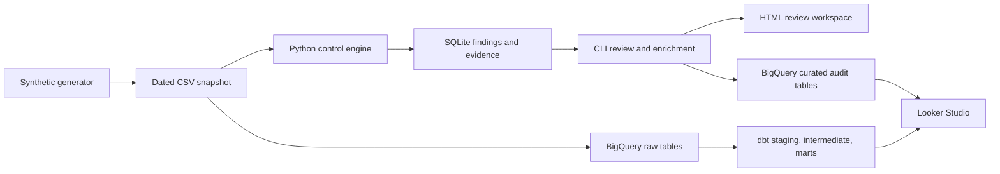

# ControlScope

**Audit analytics with traceable evidence and reproducible reviews.**

[Explore the live demo](https://5ham5h33r.github.io/controlscope/) · [Two-minute walkthrough](docs/demo.md) · [Architecture](docs/architecture.md) · [Deployment guide](docs/deployment.md)

ControlScope checks synthetic financial transactions and identity events for control exceptions, ranks the findings for review, and links each finding to the exact records that triggered it. Reviewers can confirm, dismiss, or override a finding while preserving the original result and decision history.

**Stack:** Python · SQL · dbt · BigQuery · SQLite · Looker Studio · optional Gemini enrichment

## Why this project exists

An audit finding is useful only when someone can explain why it was flagged, inspect its evidence, and reproduce the check. ControlScope connects those steps in one workflow: generate a dated dataset, run versioned controls, inspect source records, record a decision, and publish the results.

For example, a terminated employee's login becomes a finding with both the employee record and the access event attached. A reviewer can inspect those records and record a reasoned decision without changing the original evidence.

This is a portfolio project using synthetic data. Findings are review leads, and the scores indicate review priority rather than the probability of misconduct.

## Explore the demo

**[Open ControlScope →](https://5ham5h33r.github.io/controlscope/)** — no sign-in or cloud account required.

1. Start on **Overview** to see the highest-priority open findings.
2. Open **Terminated user login** to inspect the control rationale and linked source records.
3. Use **Findings** to search and filter, **Controls** to inspect all ten checks, and **Run details** to examine the run manifest.

The published snapshot contains **272 source records, 11 findings, 33 evidence links, and 10 controls**, using seed `42` and snapshot date `2026-01-31`. These are demonstration counts, not measured production outcomes. The site is a static snapshot; local CLI commands record decisions and regenerate the dashboard. See the [walkthrough](docs/demo.md) for the full review loop.

## What the implementation demonstrates

| Capability | Implementation |
| --- | --- |
| Repeatable analytics | Versioned controls; deterministic synthetic data; dataset, source-code, and registry hashes |
| Warehouse modeling | dbt staging, intermediate, and mart models over BigQuery sources |
| Anomaly detection | Median/MAD detectors for payment amounts and login bursts |
| Evidence integrity | Findings reference source rows from the same run; integrity checks reject broken links |
| Auditable review | Required actor and rationale; append-only decisions with prior and replacement values |
| Constrained AI enrichment | Gemini selects allowed fact and review-step IDs; validated selections are rendered from known text |
| Usable reporting | Public review workspace, local HTML export, and a separate Looker Studio report |

## Run locally

Requires Git and Python 3.11 or newer. The local demo has no runtime Python dependencies or cloud credentials. Run these commands from the cloned repository:

```bash
git clone https://github.com/5ham5h33r/controlscope.git
cd controlscope
python -m venv .venv
```

Activate the environment:

```powershell
# Windows PowerShell
.venv\Scripts\Activate.ps1
```

```bash
# macOS / Linux
source .venv/bin/activate
```

Then install and run:

```bash
python -m pip install -e .
controlscope demo
controlscope findings
controlscope dashboard
controlscope verify
```

Open `data/dashboard.html` in your browser. A fresh default run produces 11 findings; `verify` should report `"ok": true` with no errors. Installation needs access to a Python package index; the installed local workflow runs offline.

To record a decision, replace `FINDING_ID` with an ID from `controlscope findings`. This example dismisses a finding after reviewing its evidence:

```bash
controlscope show FINDING_ID
controlscope review FINDING_ID dismiss --actor analyst@example.test --reason "Approved test transaction"
controlscope enrich FINDING_ID
controlscope export
controlscope dashboard
```

The default enrichment provider uses local templates. `export` writes `data/audit-summary.json`. Refresh the browser after rebuilding the dashboard to see the decision. The [walkthrough](docs/demo.md) also covers confirmation, score overrides, and alternate snapshots.

## Controls and scoring

The [control registry](controls/registry.json) defines each check's version, description, and base score. The [dbt seed](seeds/control_registry.csv) mirrors those settings; a test checks that they match.

| Rule | Trigger |
| --- | --- |
| Duplicate invoice | Same vendor and invoice ID occur in more than one paid row |
| Split payment | At least two same-day payments below USD 10,000 to one vendor total USD 10,000 or more |
| Off-hours payment | Paid between 22:00 and 06:00 UTC |
| Inactive vendor payment | Paid row references an inactive vendor |
| Self approval | Initiator and approver IDs match |
| Missing high-value approval | Payment above USD 25,000 has no approver ID |
| Terminated user login | A terminated user has a login event |
| Dormant privileged login | At least 30 days between a privileged user's logins |

Two additional statistical detectors flag payment amount outliers and login bursts using median absolute deviation (MAD). Synthetic data deliberately includes scenarios for all ten checks. Detector thresholds and warehouse implementation details are documented in the [architecture guide](docs/architecture.md).

Risk score = `min(100, base_risk + min(15, 5 × (evidence_row_count − 1)))`. High is 80–100, medium is 50–79, and low is 0–49.

## Architecture



The Python engine supports local review; dbt independently expresses the controls in the warehouse. Publication copies local runs, source snapshots, findings, decisions, and enrichments to BigQuery. See [data contracts and design tradeoffs](docs/architecture.md).

## Validation and current scope

```bash
python -m pip install -e ".[dev]"
ruff check src tests_unit
pytest -q tests_unit
sqlfluff lint models tests --dialect bigquery --ignore-local-config --config .sqlfluff
sqlfluff parse models --dialect bigquery --ignore-local-config --config .sqlfluff
sqlfluff parse tests --dialect bigquery --ignore-local-config --config .sqlfluff
controlscope verify
```

[GitHub Actions](https://github.com/5ham5h33r/controlscope/actions/workflows/ci.yml) runs Python tests and linting plus SQL linting/parsing. Tests cover deterministic generation, all ten injected scenarios, evidence links, run reuse, append-only reviews, registry parity, rejected enrichment IDs, and dashboard lineage. The cloud job executes dbt only when the required credentials and variables are configured; a skipped cloud integration step is not evidence of a successful warehouse run.

| Surface | Current scope |
| --- | --- |
| Public dashboard | Hosted synthetic snapshot; search, filters, evidence inspection, controls, and run details |
| Local workflow | Runnable control engine, review decisions, template enrichment, exports, and dashboard generation |
| BigQuery / dbt | Deployment recorded with 17 passing dbt tests; requires your own authorized cloud project to reproduce |
| Looker Studio | Separate report with owner-restricted access; [captures and known gaps](docs/dashboard.md) are available |
| Gemini | Optional integration requiring an API key; the public snapshot does not demonstrate a live Gemini response |

Production authentication, scheduled runs, automatic dashboard refresh, and real-world detection accuracy are outside the current scope. Reviewer identity is a caller-supplied string. The recorded BigQuery deployment uses sandbox tables that can expire; the public static demo remains independently hosted. See the [deployment record](docs/deployment.md) for dated evidence and setup instructions.

## Documentation and extension

- [Demo walkthrough](docs/demo.md): inspect a finding and complete a local review.
- [Architecture](docs/architecture.md): data contracts, lineage, detector details, and design limits.
- [Cloud deployment](docs/deployment.md): BigQuery/dbt setup, optional Gemini enrichment, and deployment record.
- [Dashboard guide](docs/dashboard.md): public workspace, Looker Studio specification, and report captures.

To add a control, update the [registry](controls/registry.json) and [dbt seed](seeds/control_registry.csv), implement the Python logic in [controls.py](src/controlscope/controls.py), and add its SQL branch to the appropriate `int_*_hits` model. Add a synthetic scenario and test, then run the validation commands above.

## Author and license

Built by **Shamsheer Abdul Rahiman**. Licensed under the [MIT License](LICENSE).
